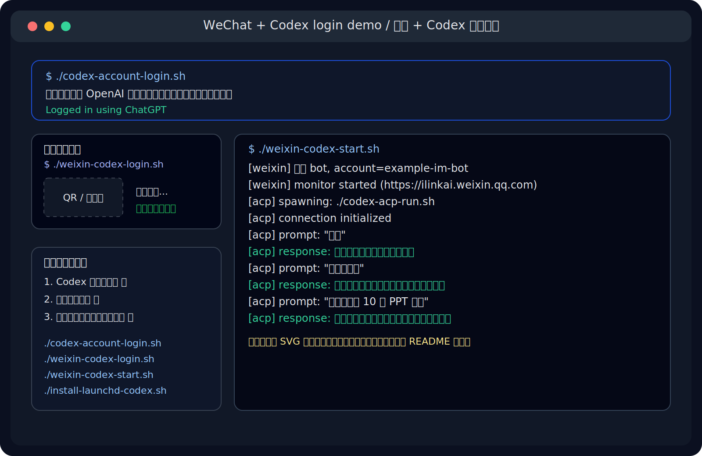
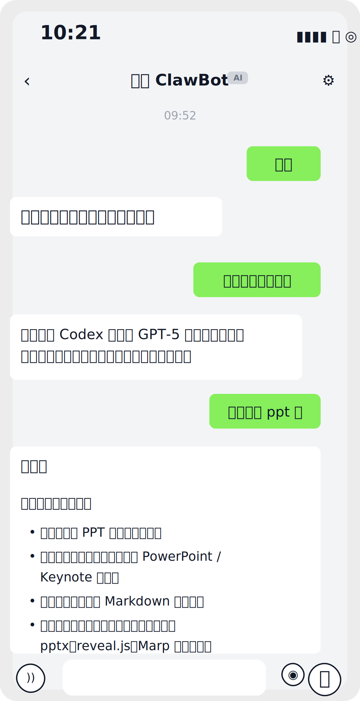
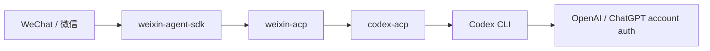
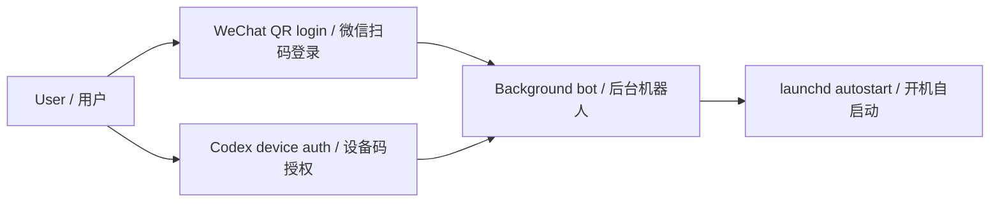

# weixin-agent-sdk

[](https://nodejs.org/)
[](LICENSE)
[](https://github.com/jiajiayao/weixin-agent-sdk/stargazers)
[](./codex-account-login.sh)

> 🤖 WeChat AI bot bridge for Codex, ACP, and OpenAI.  
> 🤖 微信 AI 机器人桥接工具，支持 Codex、ACP 和 OpenAI。

> ✨ **Supports Codex device-code / browser login on a headless machine.**  
> ✨ **重点支持 Codex 扫码式设备码授权登录，特别适合远程 Mac。**



**Real running view / 实际运行效果：**



This repository helps you connect **WeChat** to an **AI agent** with as little glue code as possible.

这个仓库的目标很直接：把 **微信** 接到 **AI Agent**，尽量少折腾中间层代码。

It is especially useful if you want:

- 💬 to chat with **Codex** through WeChat
- 🖥️ to run a **headless macOS bot**
- 📱 to use **QR login for WeChat**
- 🔐 to use **Codex account device login** instead of managing API keys
- 🔌 to connect any **ACP-compatible agent**

如果你想做下面这些事，这个仓库就是为你准备的：

- 💬 在微信里和 **Codex** 对话
- 🖥️ 在 **无头 macOS** 上长期运行机器人
- 📱 用 **微信扫码** 登录
- 🔐 用 **Codex 设备码授权登录**，而不是维护 API Key
- 🔌 接入任何兼容 **ACP** 的 Agent

## Why this fork matters | 这个分支为什么更好用

Compared with the upstream project, this fork focuses on **real deployment**.

相较于上游项目，这个分支更关注 **实际部署可用性**，而不是只停留在“能跑起来”。

It adds:

- 🚀 a practical **Codex + WeChat** flow
- 🔐 **device-auth login** for Codex on remote machines
- 🍎 **launchd autostart** scripts for macOS
- 🧩 an easier **OpenAI example** startup flow
- 📘 operational documentation for long-running bots

它额外补了这些内容：

- 🚀 可直接运行的 **Codex + 微信** 方案
- 🔐 适合远程机器的 **Codex 设备码登录**
- 🍎 面向 macOS 的 **launchd 开机自启动**
- 🧩 更易用的 **OpenAI 示例启动方式**
- 📘 更完整的长期运行与维护文档

## Highlight: Codex login first | 重点突出：Codex 登录优先

The most important feature in this fork is:

**You can log Codex in on a headless machine using OpenAI device authorization, then use it from WeChat.**

这个分支最重要的能力是：

**可以在无头机器上通过 OpenAI 设备码授权方式登录 Codex，然后直接在微信里使用它。**

If you only remember one thing, remember this:

**This repo is the “WeChat + Codex login + autostart” version.**

如果你只记住一件事，那就是：

**这个仓库主打的就是“微信 + Codex 授权登录 + 开机自启动”。**

That means:

- run `./codex-account-login.sh`
- open the printed URL in any browser
- enter the one-time code
- finish ChatGPT account authorization
- start using Codex from WeChat

也就是说：

- 运行 `./codex-account-login.sh`
- 在任意浏览器里打开终端给出的链接
- 输入一次性设备码
- 完成 ChatGPT 账号授权
- 然后就能从微信里使用 Codex

No OpenAI API key is required for this flow.

这个流程 **不需要 OpenAI API Key**。

## Architecture | 架构示意





## Repository layout | 仓库结构

```text
packages/
  sdk/                     Core WeChat bridge SDK
  agent-acp/               ACP adapter published as weixin-acp
  example-openai/          OpenAI example agent

launchd/
  ai.weixin-agent-codex.plist.example
  ai.weixin-agent-openai.plist.example

codex-account-login.sh     Codex device-auth login
codex-acp-run.sh           ACP wrapper for Codex
install-launchd-codex.sh   One-command macOS autostart installer
weixin-codex-login.sh      WeChat QR login for Codex flow
weixin-codex-start.sh      Start WeChat + Codex bot
weixin-openai-login.sh     WeChat QR login for OpenAI flow
weixin-openai-start.sh     Start OpenAI example bot
weixin-agent-openai.env.example
```

## Requirements | 环境要求

- Node.js `>= 22`
- `pnpm`
- WeChat account with QR login access
- macOS if you want `launchd` autostart

推荐安装方式：

```bash
corepack enable
corepack prepare pnpm@latest --activate
pnpm install
```

If you want to run the OpenAI example, build the SDK once:

```bash
pnpm run build:sdk
```

## Quick start | 快速开始

### Option A: Codex + WeChat | 推荐方案

This is the easiest and most practical setup for a remote Mac.

这是远程 Mac 上最推荐、最实用的方案。

#### Step 1: Install dependencies | 安装依赖

```bash
pnpm install
pnpm run build:sdk
```

#### Step 2: Log in to Codex | 登录 Codex

```bash
./codex-account-login.sh
```

This will print a device-auth URL and a one-time code.

这条命令会输出一个授权链接和一次性设备码。

You can also check login state:

```bash
./codex-account-login.sh status
```

#### Step 3: Log in to WeChat | 登录微信

```bash
./weixin-codex-login.sh
```

Scan the QR code with WeChat.

使用微信扫码即可。

#### Step 4: Start the bot | 启动机器人

```bash
./weixin-codex-start.sh
```

What happens internally:

- `weixin-codex-login.sh` runs `weixin-acp login`
- `weixin-codex-start.sh` runs `weixin-acp start -- ./codex-acp-run.sh`
- `codex-acp-run.sh` runs `codex-acp`
- `codex-acp` talks to the local Codex CLI through ACP

内部逻辑就是：

- `weixin-codex-login.sh` 调用 `weixin-acp login`
- `weixin-codex-start.sh` 调用 `weixin-acp start -- ./codex-acp-run.sh`
- `codex-acp-run.sh` 启动 `codex-acp`
- `codex-acp` 通过 ACP 和本地 Codex CLI 通信

### Option B: OpenAI API key + WeChat

If you prefer a direct OpenAI API flow:

如果你更喜欢直接使用 OpenAI API：

```bash
cp weixin-agent-openai.env.example ~/.config/weixin-agent-openai.env
chmod 600 ~/.config/weixin-agent-openai.env
```

Edit at least:

```bash
OPENAI_API_KEY=...
OPENAI_MODEL=gpt-5.4
```

Then:

```bash
./weixin-openai-login.sh
./weixin-openai-start.sh
```

### Option C: Claude via ACP

Claude support is possible through ACP, but the published adapter is API-key based, not account-login based.

Claude 也可以通过 ACP 接入，但公开发布的适配器走的是 API Key，不是账号授权登录。

## Autostart on macOS | macOS 开机自启动

The repository includes a ready-to-use installer:

仓库已经内置一键安装脚本：

```bash
./install-launchd-codex.sh
```

or:

```bash
pnpm run launchd:install:codex
```

This script:

- installs the checked-in `launchd` plist
- enables `ai.weixin-agent-codex`
- starts it immediately

这个脚本会：

- 安装仓库内的 `launchd` 模板
- 启用 `ai.weixin-agent-codex`
- 立即拉起服务

In short: login once, scan once, boot forever.

一句话总结：登录一次，扫码一次，开机常驻。

Useful log commands:

```bash
tail -f ~/Library/Logs/weixin-agent-codex.log
tail -f ~/Library/Logs/weixin-agent-codex.err.log
```

## Root scripts | 根目录脚本

```bash
./codex-account-login.sh
./weixin-codex-login.sh
./weixin-codex-start.sh
./install-launchd-codex.sh

./weixin-openai-login.sh
./weixin-openai-start.sh
```

Matching `pnpm` scripts:

```bash
pnpm run codex:login
pnpm run weixin:login:codex
pnpm run weixin:start:codex
pnpm run launchd:install:codex

pnpm run weixin:login:openai
pnpm run weixin:start:openai
```

## Development | 开发说明

Useful commands:

```bash
pnpm run build:sdk
pnpm run build:agent-acp
pnpm run typecheck
pnpm run typecheck:example-openai
pnpm run typecheck:agent-acp
```

Notes:

- `packages/example-openai` depends on the built SDK output
- `weixin-acp` is the published package name of `packages/agent-acp`
- root shell scripts are intentionally thin and SSH-friendly

说明：

- `packages/example-openai` 依赖已经构建好的 SDK
- `weixin-acp` 是 `packages/agent-acp` 对外发布时的包名
- 根目录脚本尽量保持简单，方便通过 SSH 调用

## State and secrets | 状态文件与敏感信息

WeChat-related state is usually stored under:

```text
~/.openclaw/openclaw-weixin/
```

Codex auth state is usually stored under:

```text
~/.codex/
```

OpenAI env file is expected at:

```text
~/.config/weixin-agent-openai.env
```

Do not commit:

- API keys
- WeChat account state
- Codex login state
- machine-specific logs
- machine-specific launchd files

不要提交：

- API Key
- 微信登录状态
- Codex 登录状态
- 本机日志
- 本机专用 launchd 文件

## Search keywords | 便于搜索的关键词

This repository is relevant if you are searching for:

- WeChat AI agent
- WeChat Codex
- Codex device auth
- Codex QR style login
- WeChat OpenAI bot
- ACP WeChat bridge
- macOS launchd AI bot
- 微信 AI Agent
- 微信 Codex
- Codex 设备码登录
- 微信 OpenAI 机器人
- ACP 微信桥接

## Credits | 致谢

This project is adapted from the ideas and implementation approach of the upstream WeChat bridge project:

- [@tencent-weixin/openclaw-weixin](https://npmx.dev/package/@tencent-weixin/openclaw-weixin)

And it builds on:

- [ACP](https://agentclientprotocol.com/)
- [weixin-acp](https://www.npmjs.com/package/weixin-acp)
- [codex-acp](https://www.npmjs.com/package/@zed-industries/codex-acp)
- [OpenAI Codex CLI](https://www.npmjs.com/package/@openai/codex)
